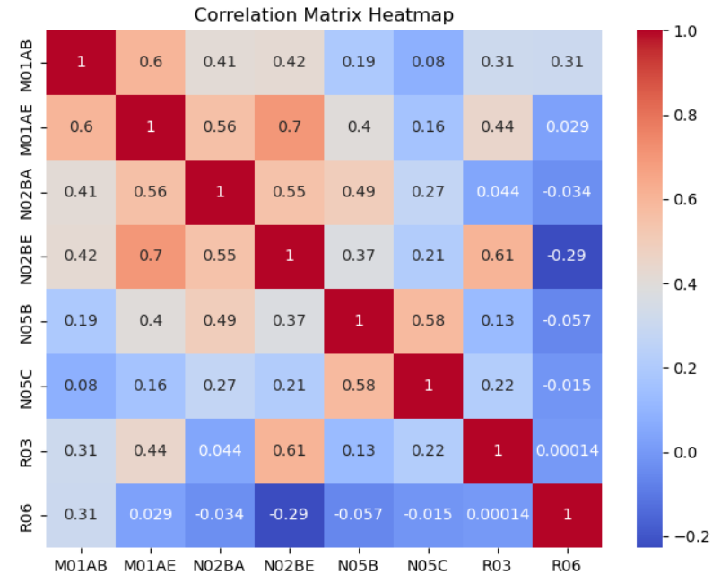

# Predicting Pharmacutical Sales

My objective was to forecast pharmaceutical sales with machine learning models. I utilized this [dataset](https://www.kaggle.com/datasets/milanzdravkovic/pharma-sales-data), comprised of over 600,000 transactional records gathered over a six-year period (2014-2019). I aimed to predict sales quantities after 2019.

### Tools and Libraries Used
* Pandas
* Matplotlib
* Plotly
* Seaborn
* scikit-learn

## Data Description

Sales data was resampled to reflect hourly, daily, weekly and monthly periods. 57 drug types were sampled and classified to the following Anatomical Therapeutic Chemical (ATC) Classification System categories:

| Feature Descriptions  |
|---|
| M01AB : Anti-inflammatory and antirheumatic products, non-steroids, Acetic acid derivatives and related substances  |
| M01AE : Anti-inflammatory and antirheumatic products, non-steroids, Propionic acid derivatives  |
| N02BA : Other analgesics and antipyretics, Salicylic acid and derivatives  |
| N02BE/B : Other analgesics and antipyretics, Pyrazolones and Anilides  |
| N05B : Psycholeptics drugs, Anxiolytic drugs  |
| N05C : Psycholeptics drugs, Hypnotics and sedatives drugs  |
| R03 : Antihistamines for systemic use  |

## Questions to Consider:

* Given the data available, what ATC category sells the largest quantities over time?
* Are there certain period which more drugs are sold?

## How to run the model:
1. Download the repository.
2. The CSV files can be found in the "Resources" folder.
3. Use the ipynb file "Predicting Pharmaceuticals Sales" to run the code. I used Jupyter Notebook.

## Data Cleaning and Exploration

I loaded the daily sales data and updated the "datum", "Year", and "Month" columns to datetime.
Using pd.melt I reshaped the data from wide to long where each row represents a individual observations for each drug unit sold. 

Using the monthly sales data I created a correlation matrix heatmap:  

 

The correlation coefficient quantifies the strength of a linear relationship between two variables. The correlation coefficient can range from -1 to 1.  
Positive correlation: as the value of one variable increases, the value of the other variable also tends to increase. 
Negative correlation: as the value of one variable increases, the value of the other variable tends to decrease.  
Strong correlations:  
M01AE AND N02BE 
N02BA AND N02BE 
R03 AND N02BE 

After calculating quantity sold per month, I visualized the results with plotly:  

Quantity sold per year was visualized as well:  

M01AE which are anti-inflammatory and antirheumatic products, non-steroids, Acetic acid derivatives and related substances were sold in the highest quntities through both months and years.

## Linear Regression Model

Next, I created a linear regression model using the "Year" variable to reshape the data as a single column array. The dependent variable was "Quantity". Predictions were fit into a linear regression:  

The metrics were quite poor which means that a linear regression model does not explain the variance of the dependent variable. The variables may be too complex or non-linear. More analysis is necessary. Next, I will explore more complex models.

## Random Forest Regressior Model
Next, I processed the data before creating a model. 
* I encoded "Weekday Name" and "Drug Type".
* Data was split by year to create more instances and trained/tested by "Quantity".  
  

After creating a random forest model, here were my results:  

Root Mean Squared Error: 6.523205418930547 
* RMSE is the square root of the average of squared differences between predicted and actual values. The model's predictions are off by approximately 6.5 units in the same scale as the target variable. Lower RMSE values are desirable.

Mean Squared Error: 42.55220893756485 
* Mean Squared Error (MSE) is a measure of the average squared difference between predicted values and actual values. Since the data is relatively large (16848 rows × 6 columns) a MSE if 42 may be acceptable but future refinements may be needed.

## Find and Remove Outliers

In order to improve results, I found and removed outliers in the data by calculating the IQE, defining upper and lower bounds, and removing outliers.\
* The dataframe was now 14875 rows × 6 columns.

## Retrain and Retest Data

Finally, I retrained and retested the data without outliers. The RMSE AND MSE improved. Here were the final results:  
Root Mean Squared Error: 2.9889644473178123  
Mean Squared Error: 8.933908467329875 

## Conclusions
	
* The Logistic Regression model was not useful in predicting pharmacutical sales because the dataset was complex and non-linear. More robust models should be used.
* Using a Random Forest Regressor model produced better RMSE and MSE scores.
* Removing outliers from the dataset improved results further. 

## Suggestions for the Future

* Other models can be incorporated like SVR, Gradient Boosting, Decision Trees, etc.
* You can use XGBoost Parameter Tuning to find the parameters that would yeild the best results. Though it can be difficult to improve models effectively with this algoritm and it may take a long time for a machine to do the computations for a Random Forest Model. 

